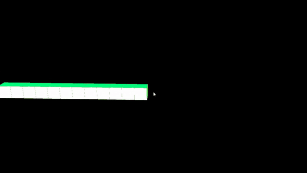
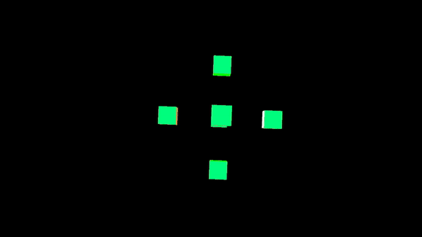
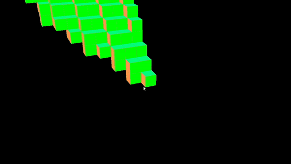
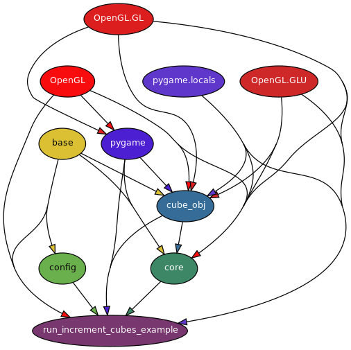

# PyOpenGL cube placing
This repository contains Python OpenGL environment with this functionality:

- Creating cube objects on arbitrary position
  <file:core.py, class:SceneManager, function:add_cube(), example: run_increment_cubes_example.py>

- Creating cube objects on grid position
  <file:core.py, class:SceneManager, function:add_cube_on_grid(), example: run_increment_cubes_example.py (just swap add_cube() with add_cube_on_grid())>

  

- Converting 3D point-cloud to unique and non repeating 3D cubes
  <file:entity.py, class:Entity, function:update_from_points(), example: run_create_entity_from_points_example.py>

  

- Filling a 3D triangle with cubes where the triangle is specified by its corner
  vertices in 3D space
  <file: triangle.py, function:get_triangle_side(), example: run_fill_triangle_example.py >

  

- Environment movement with 'w','s','a','d', mouse for rotation and 'e','q' for elevation
  source: https://stackoverflow.com/questions/56609044/how-create-a-camera-on-pyopengl-that-can-do-perspective-rotations-on-mouse-mov/56609894#56609894


## Dependencies

  Conda environment dependencies in 'environment.yml'

## Architecture



### class: SceneManager

SceneManager takes care of OpenGL initialization, rendering, user input control and adding cubes to scene.
In order to render object/entity in a scene, objects have to be added/be included in the
SceneManager.scene_objects, or SceneManager.entities.

#### Functions

  - Called at the beginning
  ```
  def initialize_scene(self):
  ```

  - Called by event_check() - logic for w,s,a,d+mouse movement
  ```
  def mouse_movement(self, event): # <pygame.event>
  ```

  - Here implement your additional keyboard controls
  ```
  def event_check(self):
  ```

  - Display scene and render all objects
  ```
  def display_scene(self,
    ms_delay # <int>
    ):
  ```

  - Add cube into the scene
  ```
  def add_cube(self, cube_centroid_position,  # <class:Position>
        cube_color, # <class:Color>
        uni_color, # <bool> Use 1 color (True) or default multiple colors (False)
        object_id, # <int>
        transparent, # <bool>
        scale): # <float: 0.0 to 1.0>
  ```
  - Add cube to the "grid structure" so that all the added cubes will clip right next to each other
    and the minimum x/y/z-axis distance between cubes will be the size of the x/y/z-axis
    grid sizes
  ```
  def add_cube_on_grid(self, cube_centroid_position,  # <class:Position>
        cube_color, # <class:Color>
        uni_color, # <bool> Use 1 color (True) or default multiple colors (False)
        object_id, # <int>
        transparent, # <bool>
        scale): # <float: 0.0 to 1.0>
  ```

### class: Entity

Entity is a class which groups object together by its entity_id or color.
Pointcloud of a person represented by cubes can be an example of separate entity.

#### Functions     
  - Will be called by SceneManager while rendering objects
  def render(self):

  - This function converts 3D position points (list of <class:Position>) to objects
    used by this entity so that even if there are 10 points per 1 grid cube, we will have 1 grid cube in a grid
    world - no duplicates. Removes old objects!
  ```
  def update_from_points(self, position_points,
              entity_id,             # <int>
              entity_color,          # <class:Color>
              grid_dimensions,       # <class:Dimensions>
              uni_color=False,       # <bool>
              transparent=False):    # <bool>
  ```

  - Remove old entity objects - add new, change id
  ```
  def update_from_objects(self,
              objects,     # <list<Class:Cube>>
              entity_id):  # <int>
  ```

### class: Cube

Basic object with its definitions of edges, surfaces, normal-sides, colors and vertices

##### Functions
  - Changing scale will result in a cube with edges of size 'scale'
  ```
  def rescale(self, scale=1.0): # scale: <float (0.0 to 1.0) >
  ```

  - Called by class:SceneManager in order to render the object in the scene
  ```
  def render(self):
  ```

### class: Dimensions/Position

Helper class for easier operation with dimensions and positions/points.

#### Functions
  ```
  def get_tuple(self):
      return (self.x, self.y, self.z)
  ```
### class: Color

Helper class for easier manipulation with colors.

#### Functions
  ```
  def get_tuple(self):
    return (self.R, self.G, self.B)
  ```
## Sources
### Cube example and setup
https://pythonprogramming.net/opengl-rotating-cube-example-pyopengl-tutorial/
### Mouse movement
https://stackoverflow.com/questions/56609044/how-create-a-camera-on-pyopengl-that-can-do-perspective-rotations-on-mouse-mov/56609894#56609894
### Better cube visualization
https://stackoverflow.com/questions/56514791/how-to-correctly-add-a-light-to-make-object-get-a-better-view-with-pygame-and-py
